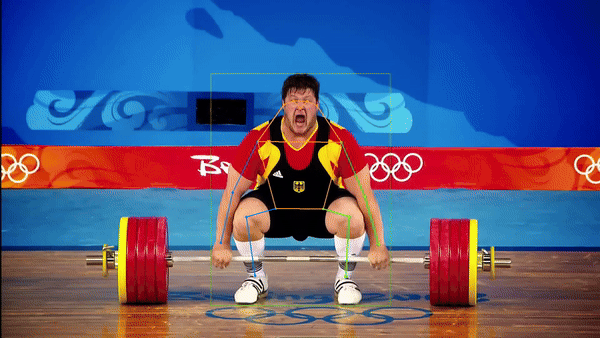
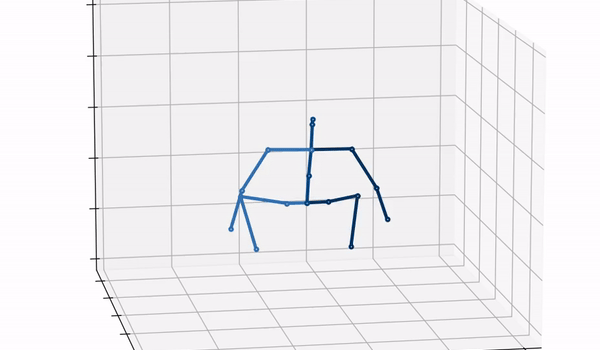

# PerfectRep - 3D Pose Analysis for Powerlifters 🏋️🦾

<a href="https://pytorch.org/get-started/locally/"></a>

[](https://github.com/AndrewBoessen/PerfectRep/actions/workflows/python-app.yml)


PerfectRep is a 3D pose estimation model tailored specifically for powerlifting analysis. It allows for precise tracking and analysis of lifter's movements to ensure perfect form and technique.

## Dependencies

- Python >= 3.7
- Pytorch
- Cuda=11.8
- NumPy
- Matplotlib
- Pandas

## Installation

1. Clone the repository:

   ```bash
   git clone https://github.com/AndrewBoessen/PerfectRep.git
   ```

2. Navigate to the project directory:

   ```bash
   cd PerfectRep
   ```

3. Create Virtual Environment:

   ```bash
   conda create -n perfectrep python=3.7 anaconda
   conda activate perfectrep
   # Please install PyTorch according to your CUDA version.
   conda install pytorch torchvision torchaudio pytorch-cuda=11.8 -c pytorch -c nvidia
   pip install -r requirements.txt
   ```

## Training Instructions

1. Prepare your dataset in the appropriate format. Have required preprocessed data in the correct directory. See [Data Preprocessing](#data-preprocessing) for more info

2. Train the model using the provided training script:

   ```bash
   python train.py --data_path /path/to/dataset --epochs 100 --batch_size 32
   ```

3. Monitor the training progress and adjust hyperparameters and config file as necessary.

## Finetune 3D Pose

As we utilize 2D-to-3D lifting as the pretext task, we simply reuse the whole pretrained network. During finetuning, the input 2D skeletons are estimated from videos without extra masks or noises.

See [3D Pose Estimation](./docs/3D-pose.md) for training instructions and more info

## Finetune Action Classifier

Action classifier for powerlifting. Classify clip as squat, deadlift, or bench press.

See [Action Classifier](./docs/action.md) for training instructions and more info

## In-the-wild Inference



### 2D Keypoints

Use [ViTPose](https://arxiv.org/abs/2204.12484) to extract 2d skeleton keypoints from video or image. Use COCO keypoint format and save frame keypoints in a json file. See [easy_ViTPose](https://github.com/JunkyByte/easy_ViTPose) for instructions on ViTPose inference.

### Checkpoint

Download model checkpoint [best_epoch.bin](https://drive.google.com/file/d/1Al49MhmvG3IG2ASWcb6Mx8mymArmb7Wz/view?usp=drive_link) or train model from scratch

### 3D Pose



1. Perform inference on a single image:

   ```bash
   python infer_wild.py\
   --config train_config.yaml\
   --checkpoint /path/to/checkpoint\
   --json_path keypoint_json\
   --image /path/to/image.jpg\
   --out_path /output/path/
   ```

2. Process a video to analyze multiple frames:

   ```bash
   python infer_wild.py\
   --config train_config.yaml\
   --checkpoint /path/to/checkpoint\
   --json_path keypoint_json\
   --video /path/to/video.mp4\
   --out_path /output/path/
   ```

## Data Preprocessing

For pretraing we use the Fit3D data set which is also used for finetuning 3D pose and classification. The data set must be preprocessed before being used for training.

### Download

> Note that the preprocessed data is only intended for reproducing our results more easily. If you want to use the dataset, please register to the [Fit3D website](https://fit3d.imar.ro/home) and download the dataset in its original format.

| Dataset | Description                                                                | Size    | Download Link                                                                                           |
| ------- | -------------------------------------------------------------------------- | ------- | ------------------------------------------------------------------------------------------------------- |
| Fit3D   | Fit3D is a dataset for 3D human-interpretable models for fitness training. | 1.96 GB | [Download Fit3D](https://drive.google.com/file/d/1B8BT67Q_ZLbT638cbT3msoIYWUwYWzxz/view?usp=drive_link) |

1. Once downloaded unzip the files into `data/motion3d`

2. Slice the data into clips (len=243, stride=81)

```bash
python process_fit3d.py
```

> To processes the raw dataset downloaded from [Fit3D website](https://fit3d.imar.ro/home) place the train dataset and `fit3d_info.json`file in `data/fit3d/` and run

```bash
python compress_fit3d.py
```

> Note it is still necessary to slice the data into clips after the raw data set has been preprocessed

## Documentation

[](/docs/ "Go to project documentation")

- [Pretrain Model](./docs/pretrain.md)
- [3D Pose Estimation](./docs/3D-pose.md)
- [Action Classifier](./docs/action.md)
- [Form Analysis](./docs/form-analysis.md)
- [Data Set](./docs/dataset.md)
- [References](./docs/reference.md)

## References

- [MotionBERT](https://arxiv.org/pdf/2210.06551.pdf)
- [AIFit](https://mihaifieraru.github.io/publication/fieraru_2021_cvpr/Fieraru_2021_CVPR.pdf)
