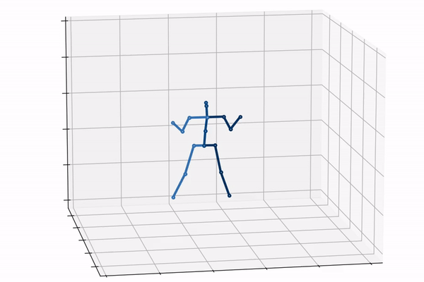

# 3D Pose Extimation




As we utilize 2D-to-3D lifting as the pretext task, we simply reuse the whole pretrained network. During finetuning, the input 2D skeletons are estimated from videos without extra masks or noises.

The 2D skeletons are provided by 2D
pose estimator trained on MPII and Human3.6M. For training from
scratch, we train for 60 epochs with learning rate 0.0002 and
batch size 32. For finetuning, we load the pretrained weights
and train for 30 epochs

## Training

### Data

Prepare your dataset in the appropriate format. Have required preprocessed data in the correct directory. See [Data Preprocessing](../README.md#data-preprocessing) for more info

### Finetune

Finetune from pretrained checkpoint. The pretrained checkpont can be downloaded [here](https://drive.google.com/file/d/1Al49MhmvG3IG2ASWcb6Mx8mymArmb7Wz/view?usp=drive_link) or trained from scratch. Place the checkpoint in save directory and run:

```bash
python train.py --config ft_3d_pose_config.yaml --selection best_epoch.bin --epochs 30 --batch_size 4
```
