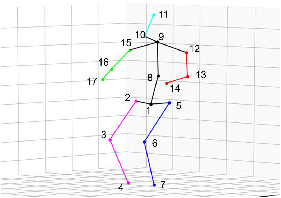

# Form Analysis

## Method:

We take an algorithmic approach to caclulate a score for a rep of a certain exercise.
Given a time series of 3D keypoints, we calcuate angle between joints, velocity, and distance between joints.
To calculate the score, we compare these values to a predefined range of 'perfect' values for a specific exercise

## Skeleton Keypoints:

_We use the Human3.6m 17 keypoints_

| Joint Number | Joint Name     |
| ------------ | -------------- |
| 0            | Root           |
| 1            | Right Hip      |
| 2            | Right Knee     |
| 3            | Right Ankle    |
| 4            | Left Hip       |
| 5            | Left Knee      |
| 6            | Left Ankle     |
| 7            | Belly          |
| 8            | Neck           |
| 9            | Nose           |
| 10           | Head           |
| 11           | Left Shoulder  |
| 12           | Left Elbow     |
| 13           | Left Wrist     |
| 14           | Right Shoulder |
| 15           | Right Elbow    |
| 16           | Right Wrist    |

### Limbs:

| Limb ID | Joint 1        | Joint 2        |
| ------- | -------------- | -------------- |
| 0       | Root           | Right Hip      |
| 1       | Right Hip      | Right Knee     |
| 2       | Right Knee     | Right Ankle    |
| 3       | Root           | Left Hip       |
| 4       | Left Hip       | Left Knee      |
| 5       | Left Knee      | Left Ankle     |
| 6       | Root           | Belly          |
| 7       | Belly          | Neck           |
| 8       | Neck           | Nose           |
| 9       | Nose           | Head           |
| 10      | Neck           | Left Shoulder  |
| 11      | Left Shoulder  | Left Elbow     |
| 12      | Left Elbow     | Left Wrist     |
| 13      | Neck           | Right Shoulder |
| 14      | Right Shoulder | Right Elbow    |
| 15      | Right Elbow    | Right Wrist    |

### Angles:

| Angle ID | Joint 1        | Joint 2        |
| -------- | -------------- | -------------- |
| 0        | Root           | Right Ankle    |
| 1        | Root           | Belly          |
| 2        | Right Ankle    | Belly          |
| 3        | Root           | Right Hip      |
| 4        | Right Hip      | Right Knee     |
| 5        | Right Ankle    | Left Hip       |
| 6        | Left Hip       | Left Knee      |
| 7        | Belly          | Neck           |
| 8        | Neck           | Head           |
| 9        | Neck           | Right Shoulder |
| 10       | Head           | Right Shoulder |
| 11       | Neck           | Nose           |
| 12       | Nose           | Neck           |
| 13       | Belly          | Neck           |
| 14       | Neck           | Left Shoulder  |
| 15       | Left Shoulder  | Left Elbow     |
| 16       | Right Shoulder | Right Elbow    |
| 17       | Right Elbow    | Right Wrist    |

## Calculations:

| Metric   | Formula                                                                                                                                                       |
| -------- | ------------------------------------------------------------------------------------------------------------------------------------------------------------- |
| Angle    | $\theta = \cos^{-1}\left(\frac{{\mathbf{a} \cdot \mathbf{b}}}{{\lVert \mathbf{a} \rVert \cdot \lVert \mathbf{b} \rVert}}\right)$                              |
| Velocity | $\mathbf{v}_{P_{F_2/F_1}} = \frac{d\mathbf{r}_2}{dt} = \frac{d(\mathbf{r}_1 + \mathbf{r}_{1P})}{dt} = \frac{d\mathbf{r}_1}{dt} + \frac{d\mathbf{r}_{1P}}{dt}$ |
| Distance | $d = \sqrt{(x_2 - x_1)^2 + (y_2 - y_1)^2 + (z_2 - z_1)^2}$                                                                                                    |
