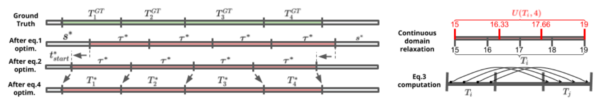

# Form Analysis

## Method:

We take an algorithmic approach to caclulate a score for a rep of a certain exercise.
Given a time series of 3D keypoints, we calcuate angle between joints, velocity, and distance between joints.
To calculate the score, we compare these values to a predefined range of 'perfect' values for a specific exercise

## Skeleton Keypoints:

_We use the Human3.6m 17 keypoints_

| Joint Number | Joint Name     |
| ------------ | -------------- |
| 0            | Root           |
| 1            | Right Hip      |
| 2            | Right Knee     |
| 3            | Right Ankle    |
| 4            | Left Hip       |
| 5            | Left Knee      |
| 6            | Left Ankle     |
| 7            | Belly          |
| 8            | Neck           |
| 9            | Nose           |
| 10           | Head           |
| 11           | Left Shoulder  |
| 12           | Left Elbow     |
| 13           | Left Wrist     |
| 14           | Right Shoulder |
| 15           | Right Elbow    |
| 16           | Right Wrist    |

## Rep Segmentation

We split a video of mutliple repeititons of the same exercise into individual clips containing a single repetition.

These clips are used later for analysis and tracking form across a whole set of reps.

The algorithm we used is derived from [AIFit](https://openaccess.thecvf.com/content/CVPR2021/papers/Fieraru_AIFit_Automatic_3D_Human-Interpretable_Feedback_Models_for_Fitness_Training_CVPR_2021_paper.pdf). We first achieve an estimate using a fixed clip length and optimize to find individual clip start and stop frames.

### Initialization

To obtain an initial estimate of the segmentation, we follow these steps:

1. Assume a fixed-period pose signal:
   $T_{init} = T(t_{start}, \tau) = \{T_i | t_i = t_{start} + (i - 1)\tau\}$

   - $\tau$: period
   - $t_{start}$: starting point of repetitions

2. Define affinity between two 3D poses:
   $A(p_m, p_n)$ = negative mean per joint position error (MPJPE) between $p_m$ and $p_n$

3. Determine initial period estimate $\tau^*$ using auto-correlation:
   $R_{PP}(\tau, s) = \frac{1}{N - 2s - \tau} \sum_{t=s}^{N-s-\tau} A(p_t, p_{t+\tau})$

   - $s$: signal shrinkage at both ends to account for noise
   - $N$: total number of poses

4. Iterate over $s$ and $\tau$ to find $\tau^*$:
   - Select smallest $\tau$ where $R_{PP}(\tau, s)$ reaches a local maximum
   - Corresponding $s$ becomes $s^*$

$\tau^*$ represents the period that maximizes the auto-correlation of the signal, accounting for noise outside repetitions.

### Finding the Start of the First Repetition

After estimating the period $\tau^*$, we search for the beginning of the first repetition $t_{start}$ by maximizing the average affinity $A_{avg}$ of $T(t_{start}, \tau^*)$:

$A_{avg}(T) = \frac{1}{k_{min}^2} \sum_{i=1}^{k_{min}} \sum_{j=1}^{k_{min}} A_{seq}(T_i, T_j)$

where:

$A_{seq}(T_i, T_j) = \frac{1}{\tau^*} \sum_{l=1}^{\tau^*} A(p_{t_i+l}, p_{t_j+l})$

- $A_{seq}(T_i, T_j)$ computes the similarity between two repetitions of equal period $\tau^*$ (intervals $T_i$ and $T_j$).
- $A_{avg}(T)$ averages similarities between all possible pairs of intervals, representing a global affinity of the repetition segmentation $T$.
- At this stage, $T$ is parameterized only by $t_{start}$, since $\tau^*$ was found in the previous step.

We select $t^*_{start}$ as the smallest value for which $A_{avg}(T(t_{start}, \tau^*))$ has a local maximum. This approach:

1. Provides the highest similarity between repetitions.
2. Uses the smallest such maximum to prevent solutions like the beginning of the 2nd/3rd/etc. interval, which are also local maxima.

## Calculations:

| Metric   | Formula                                                                                                                                                       |
| -------- | ------------------------------------------------------------------------------------------------------------------------------------------------------------- |
| Angle    | $\theta = \cos^{-1}\left(\frac{{\mathbf{a} \cdot \mathbf{b}}}{{\lVert \mathbf{a} \rVert \cdot \lVert \mathbf{b} \rVert}}\right)$                              |
| Velocity | $\mathbf{v}_{P_{F_2/F_1}} = \frac{d\mathbf{r}_2}{dt} = \frac{d(\mathbf{r}_1 + \mathbf{r}_{1P})}{dt} = \frac{d\mathbf{r}_1}{dt} + \frac{d\mathbf{r}_{1P}}{dt}$ |
| Distance | $d = \sqrt{(x_2 - x_1)^2 + (y_2 - y_1)^2 + (z_2 - z_1)^2}$                                                                                                    |
