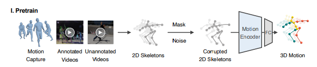

# Pretrain Model

### _A motion encoder to accomplish the 2D-to-3D lifting task_

### - Architecture:

- **Input** _2D skeleton sequences_

  - Represented as a tensor. Each set of keypoints $x$ in the series is a vector.

    $x \in \mathbb{R}^{(T \times J \times C_{\text{in}})}$

    Here, $T$ denotes the sequence length, and $J$ denotes the number of body joints. $C_{\text{in}}$ denotes the channelnumber of input.

- **Output** _3D skeleton sequences_

  - Represented as tensor. Each set of keypoints $\hat{X}$ in the series is a vector

    $\hat{X} \in \mathbb{R}^{(T \times J \times C_{\text{out}})}$

    Here, $T$ denotes the sequence length, and $J$ denotes the number of body joints. $C_{\text{out}}$ denotes the channelnumber of output.

- **Backbone** _DSTformer_

  - DSTformer consists of $N$ dual-stream-fusion modules.

    Each module contains two branches of spatial or temporal MHSA and MLP.

    The Spatial MHSA models the connection among different joints within a timestep, while the Temporal MHSA models the movement of one joint

  - **Spatial Block**

    - Spatial MHSA (S-MHSA) aims at modeling the relationship among the joints within the same time step. It is defined as

      $\text{S-MHSA}(Q_S, K_S, V_S) = [\text{head}_1; \ldots; \text{head}_h]W_S^P$,

      $\text{head}_i = \text{softmax}\left(\frac{Q_S^i (K_S^i)^\prime}{\sqrt{d_K}}\right)V_S^i$

      where $W_S^P$ is a projection parameter matrix, $h$ is the number of the heads, $i \in 1, . . . , h$, and $′$ denotes matrix transpose.

      We utilize self-attention to get the query $Q^S$, key $K^S$, and value $V^S$ from input per-frame spatial feature $F_S \in \mathbb{R}^{J \times Ce}$ for each head $_i$

      $Q_S^i = F_{S}W_{S}^{(Q,i)}, \quad K_S^i = F_{S}W_{S}^{(K,i)}, \quad V_S^i = F_{S}W_{S}^{(V,i)}$,

      where $W_S^{(Q,i)}$, $W_S^{(K,i)}$, $W_S^{(V,i)}$ are projection matrices, and $d_K$ is the feature dimension of $K_S$.

      We apply S-MHSA to 3 features of different time steps in parallel. Residual connection and layer normalization (LayerNorm) are used to the S-MHSA result, which is further fed into a multilayer perceptron (MLP), and followed by a residual connection and LayerNorm following

  - **Temporal Block**

    - Temporal MHSA (T-MHSA) aims at
      modeling the relationship across the time steps for a body
      joint. Its computation process is similar with S-MHSA except that the MHSA is applied to the per-joint temporal
      feature $F_T \in \mathbb{R}^{T \times C_e}$ and parallelized over the spatial dimension

      $\text{T-MHSA}(Q_T, K_T, V_T) = [\text{head}_1; \ldots; \text{head}_h]W_T^P$,

      $\text{head}_i = \text{softmax}\left(\frac{Q_T^i (K_T^i)^\prime}{\sqrt{d_K}}\right)V_T^i$

      where $i \in 1,...,h, Q_T, K_T, V_T$ are computed similar with S-MHSA

### - Implementation:

We implement the proposed motion encoder DSTformer
with depth $N = 5$, number of heads $h = 8$, feature size
$C_f = 512$, embedding size $C_e = 512$. For pretraining, we
use sequence length $T = 243$. The pretrained model could
handle different input lengths thanks to the Transformerbased backbone. During finetuning, we set the backbone
learning rate to be $0.1 ×$ of the new layer learning rate. We
introduce the experiment datasets in the following sections
respectively

### - Training:

#### Data Processing / Augmentation:

We first
extract the 2D skeleton sequences $x$ by projecting the 3D
motion orthographically. Then, we corrupt $x$ by randomly
masking and adding noise to produce the corrupted 2D skeleton sequences, which also resemble the 2D detection results
as it contains occlusions, detection failures, and errors. Both
joint-level and frame-level masks are applied with certain
probabilities We sample motion clips with length $T = 243$ for
3D mocap data. We set the input channels $C_{in} = 3 (x, y$ coordinates and
confidence). Random horizontal flipping is applied as data augmentation. The whole network
is trained for 90 epochs with learning rate 0.0005 and batch
size 64 using an Adam optimizer.

#### Loss Function:

We use the aforementioned motion encoder to get motion representation $\mathbf{E}$ and reconstruct 3D motion $\mathbf{\hat{X}}$. We then compute the joint loss $\mathcal{L}_\text{3D}$ between $\mathbf{\hat{X}}$ and GT 3D motion $\mathbf{X}$. We also add the velocity loss $\mathcal{L}_\text{O}$ The 3D reconstruction losses are thus given by

$
\begin{equation}
    \mathcal{L}_\text{3D} = \sum\limits_{t=1}^{T} \sum\limits_{j=1}^{J} \parallel \mathbf{\hat{X}}_{t,j} - \mathbf{X}_{t,j} \parallel_2, \quad
    \mathcal{L}_\text{O} = \sum\limits_{t=2}^{T} \sum\limits_{j=1}^{J} \parallel \mathbf{\hat{O}}_{t,j} - \mathbf{O}_{t,j} \parallel_2,
\end{equation}
$

where $\mathbf{\hat{O}}_t=\mathbf{\hat{{X}}}_t - \mathbf{\hat{X}}*{t-1}$, $\mathbf{O}_t=\mathbf{X}_t - \mathbf{X}_{t-1}$.

The total pretraining loss is computed by
$\begin{equation}
\mathcal{L} = \underbrace{\mathcal{L}_\text{3D} + \lambda_\text{O} \mathcal{L}_\text{O}}_{\text{for 3D data}}
\end{equation}$
where $\lambda_\text{O}$ is a constant coefficient to balance the losses.
